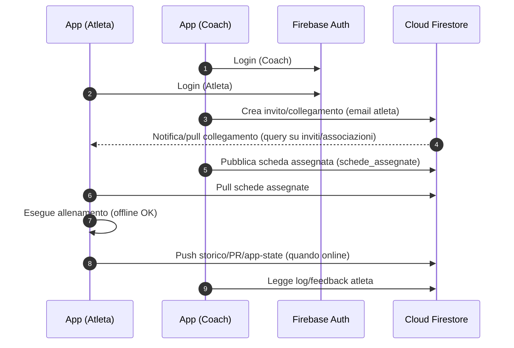
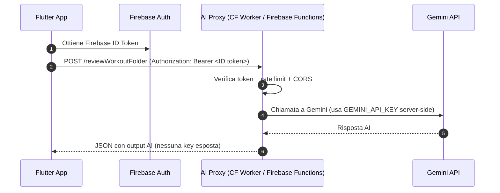

# Tiger 🐯
Applicazione **Flutter** per la gestione completa dell’allenamento **atleta/coach**: programmazione, esecuzione, progressione, storico e supporto AI — con approccio **local‑first** e sincronizzazione cloud.

> ⚠️ **Project Status: Proof of Concept (PoC) / Rapid Prototyping**  
> Questo progetto è nato come PoC per testare l'integrazione di LLM (Gemini) all'interno di un'architettura mobile Flutter, gestendo la sincronizzazione locale/cloud (Firebase) e proxy sicuri. Il codice è orientato alla prototipazione rapida per validare l'idea e le funzionalità core.

## Perché Tiger
- **Ruoli separati** atleta/coach con flussi dedicati
- **Local‑first**: l’app resta utilizzabile offline e sincronizza quando torna la connessione
- Programmazione avanzata: **RIR** e **% su 1RM**, tecniche speciali, progressioni
- **PR Mode** per Big 3 (panca/squat/stacco) con warmup e tentativi
- Modulo **dolore/recupero** con linee guida operative (informativo)
- AI integrata in modo **sicuro**: la chiave **Gemini** non è mai nel client

---

## Funzionalità

### Atleta
- Home con KPI, ultimo allenamento e **Personal Records**
- Gestione schede per **cartelle/categorie** (drag & drop)
- Esecuzione scheda con tracking serie (**kg, reps, RPE o %**)
- **Storico allenamenti** con note e dettaglio serie
- **Progressione settimana successiva** con ricalcolo carichi
- **PR Mode** Big 3 con progressione warmup
- Profilo con calendario/grafici e gestione esercizi custom
- Backup completo **JSON** locale + import da file

### Coach
- Dashboard coach + **libreria schede master**
- Collegamento atleti **tramite email**
- Invio schede all’atleta via **Firestore**
- Consultazione log atleta con dettaglio sessioni e feedback

### AI (Gemini via proxy)
- Import schede da **foto** tramite endpoint proxy
- Review di una cartella allenamenti con **analisi testuale AI**
- Normalizzazione nomi esercizi + fallback dizionario EN→IT

### Dolore e recupero (informativo)
- Selezione zona dolore condivisa tra schermate
- Profili dolore + linee guida operative
- Mini‑test euristico con confidenza
- Persistenza **locale + cloud**

---

## Stack
- Flutter 3 / Dart 3
- Firebase Auth
- Cloud Firestore
- Shared Preferences (cache/stato locale)
- HTTP client verso AI proxy
- Share / PDF / FilePicker / ImagePicker

Struttura logica:
- `lib/screens` – UI e flussi
- `lib/models` – dominio (Scheda, Esercizio, Serie, Allenamento)
- `lib/services` – logiche: carichi, AI, sync progress

---

## Persistenza e sincronizzazione

### Locale
- `schede_salvate`
- `storico_salvato`
- `personal_records`
- app state (es. zona dolore)

### Cloud (Firestore)
Esempi (in base alla configurazione del progetto):
- `users/{uid}`
- `schede_assegnate`
- `coaches/{coachId}/athletes/{athleteId}/progress/{yyyyMMdd}`
- `coaches/{coachId}/athletes/{athleteId}/stats/current`

Sincronizzazioni principali:
- pull schede assegnate dal coach → atleta
- push storico / PR / app state → cloud
- merge progressi atleta su schema coaches/athletes

---

## Diagrammi (architettura)

### Coach ↔ Atleta (Auth + Firestore sync)



### AI (Gemini) via Proxy sicuro (Cloudflare o Functions)



---

## Sicurezza & segreti (importante)
**Regola principale: nessuna API key sensibile nel client.**

- `GEMINI_API_KEY`:
  - **solo lato server/proxy**
  - **mai hardcodata** nell’app Flutter
- L’app chiama `AI_PROXY_BASE_URL` (proxy), che a sua volta chiama Gemini.

Configurazione runtime via `--dart-define`:
- `AI_PROXY_BASE_URL`
- `FIREBASE_KEY_ANDROID`
- `FIREBASE_KEY_IOS`
- `FIREBASE_KEY_WEB`

---

## AI Proxy: opzioni supportate

### Opzione A — Firebase Functions (richiede Blaze)
```bash
cd functions
npm install
cd ..
firebase functions:secrets:set GEMINI_API_KEY
firebase deploy --only functions
```

Endpoint (esempi):
- `POST {AI_PROXY_BASE_URL}/analyzeWorkoutPhoto`
- `POST {AI_PROXY_BASE_URL}/reviewWorkoutFolder`

### Opzione B — Cloudflare Worker (alternativa)
```bash
cd ai-proxy-worker
npm install
npx wrangler login
npx wrangler secret put GEMINI_API_KEY
npx wrangler deploy
```

> Consigliato aggiungere validazione richieste (token Firebase), rate limiting e CORS sul proxy.

---

## Setup sviluppo

Prerequisiti:
- Flutter SDK
- Progetto Firebase configurato
- Android Studio e/o Xcode

Installazione:
```bash
flutter pub get
flutter run
```

Esempio build release (Android):
```bash
flutter build appbundle \
  --dart-define=AI_PROXY_BASE_URL=https://<your-proxy-base-url> \
  --dart-define=FIREBASE_KEY_ANDROID=<key> \
  --dart-define=FIREBASE_KEY_IOS=<key> \
  --dart-define=FIREBASE_KEY_WEB=<key>
```

### Firma Android
1. Crea un keystore release
2. Copia `android/key.properties.example` → `android/key.properties`
3. Valorizza `storeFile`, `storePassword`, `keyAlias`, `keyPassword`

---

## Regole Firebase
File:
- `firestore.rules`
- `storage.rules`

Deploy:
```bash
firebase deploy --only firestore:rules,storage
```

---

## Test
Esecuzione:
```bash
flutter test
```

Focus test (esempi):
- import AI Big 3
- progressione settimana successiva
- compatibilità legacy
- ordinamento storico

---

## Limiti noti / note
- La qualità dell’import da foto dipende dalla leggibilità dell’input.
- Il modulo dolore è **informativo** e non sostituisce una valutazione medica.
- Le chiavi AI devono restare esclusivamente lato server.

---

## Licenza
Questo progetto è distribuito con licenza MIT. Vedi il file `LICENSE` per i dettagli.
